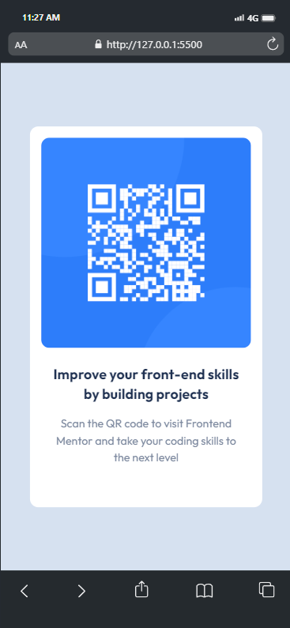
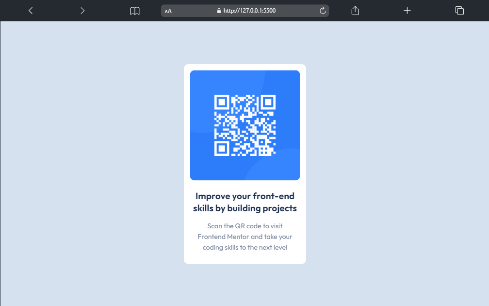

# Frontend Mentor - QR code component solution

This is a solution to the [QR code component challenge on Frontend Mentor](https://www.frontendmentor.io/challenges/qr-code-component-iux_sIO_H). Frontend Mentor challenges help you improve your coding skills by building realistic projects.

## Table of contents

- [Overview](#overview)
  - [Screenshot](#screenshot)
  - [Links](#links)
- [My process](#my-process)
  - [Built with](#built-with)
  - [What I learned](#what-i-learned)
  - [Continued development](#continued-development)
  - [Useful resources](#useful-resources)
- [Author](#author)

## Overview

The challenge is to build out this QR code component and get it looking as close to the design as possible.
I use TailwindCSS as css framework to built this component. Although I think my solution for responsiveness not quite responsive,
but I will try best for next projects!

### Screenshot

;
;

### Links

- Solution URL: [https://github.com/maulanafadilah/qr-code]
- Live Site URL: [Add live site URL here]

## My process

### Built with

- Semantic HTML5 markup
- TailwindCSS Framework (https://tailwindcss.com/)
- Mobile-first workflow
- Flexbox

### What I learned

I Learned how to create responsiveness using TailwindCSS

```html
<h1
  class="w-full h-full md:w-[40%] lg:w-[30%] lg:h-[75%] xl:w-[25%] xl:h-[70%]"
>
  Responsive width or height dependent on minimal width/height of the device
</h1>
```

### Continued development

Make the responsiveness more fluid.

## Author

- Website - [Maulana Fadilah](https://maulanafadilah.me)
- Frontend Mentor - [@maulanafadilah](https://www.frontendmentor.io/profile/maulanafadilah)
- Github - [@maulanafadilah](https://https://github.com/maulanafadilah)
